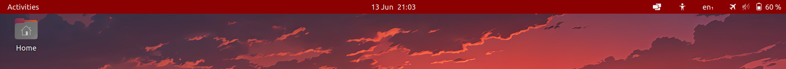

# Adaptive bar for GNOME Shell

Trivial extension that changes the colour of GNOME's top bar according to the system CPU load





## Install

```
cd ~/.local/share/gnome-shell/extensions && git@github.com:adrianlshaw/gnome-shell-extension-adaptive-bar.git
gnome-extensions enable adaptive-bar@adrianlshaw.com
```

You might need to restart GNOME by pressing Alt-F2 and entering 'r'
